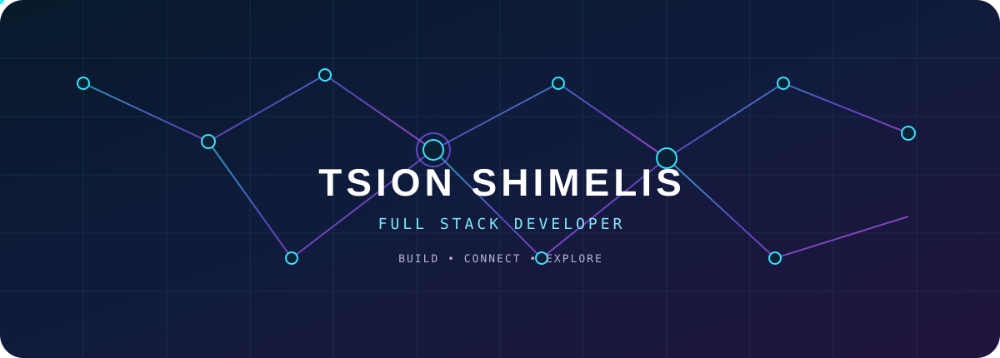

 

### `React` · `TypeScript` · `Node.js` · `Django` · `Next.js`

 

<a href="https://tsion-shimelis.vercel.app/">
PORTFOLIO
</a>
&nbsp;&nbsp;•&nbsp;&nbsp;
<a href="https://www.linkedin.com/in/tsion-shimelis-06338b320/">
LINKEDIN
</a>
&nbsp;&nbsp;•&nbsp;&nbsp;
<a href="https://github.com/Tsi2216">
GITHUB
</a>

---

## `01` / STACK

 

---

## `02` / GITHUB

 

